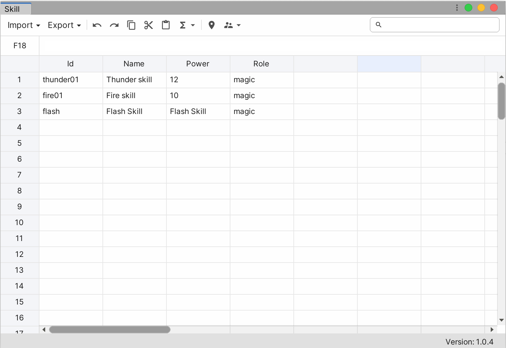
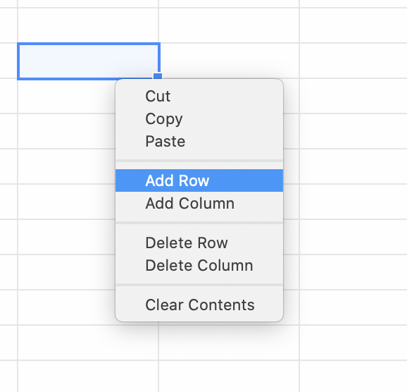
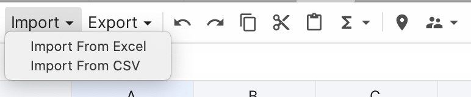
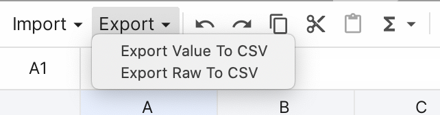
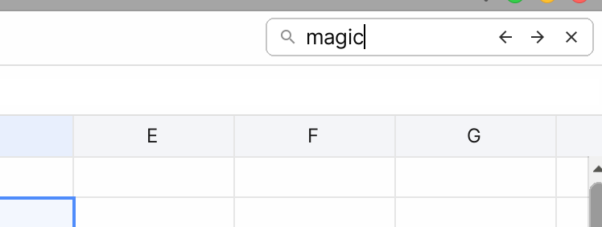
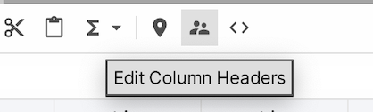
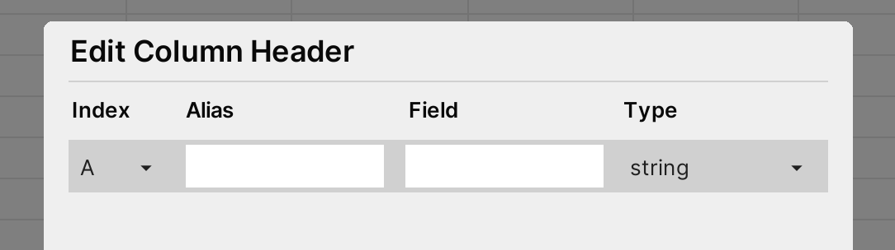
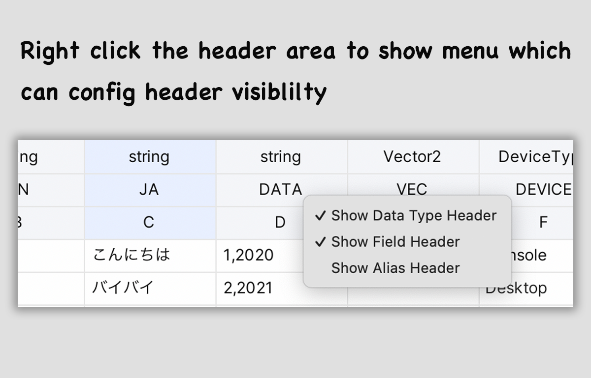
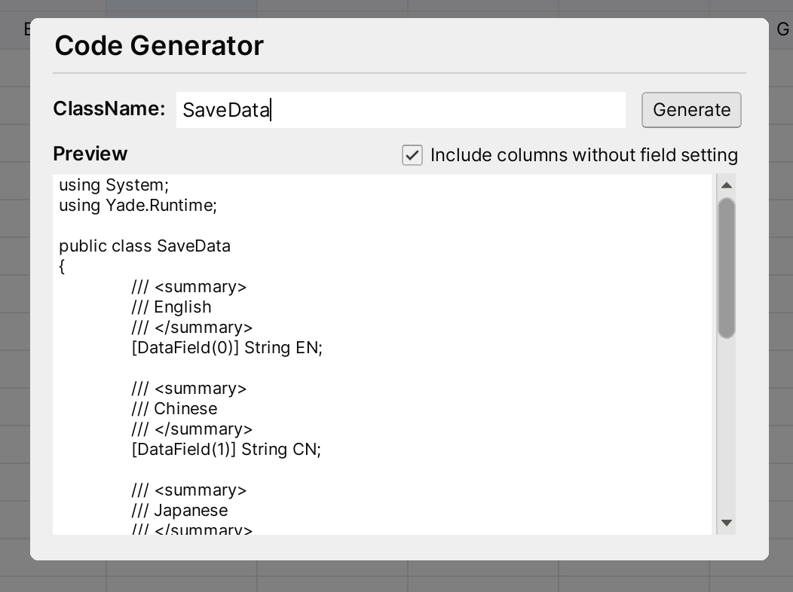

Yade
----

### Introduction

Yade (**Y**et **A**nother **D**ata **E**ditor). Yade is a extendable spreadsheet in side Unity Editor.



### Create Sheet File

Right click in Project Window and select **Create -> Yade Sheet** Menu to create a yade sheet file, double click the file to start editing.

### Edit Sheet

#### 1. Auto Fill

Left mouse down on the auto fill handle in right bottom corner of selector and drag to auto fill cells

#### 2. Add Row/Column or Delete Row/Column

Right click on selected cells and select items to add or delete row/columns



#### 4. Delete Cell

Right click on selected cells and select  `Clear Contents` item or Press `Delete` key on the keyboard will delete selected cells

#### 5. Add Asset Cell

Drag assets from Project Window to yade sheet or using the formula function `ASSET`. For example:

> =ASSET("Assets/icons.json")

Above formula will create a asset cell which point to the asset icon.json

#### 6. Add Enum Cell

Set raw value of cell following the format below:

> =ENUM("[Type]", "[MemberName]")

* `[Type]` threshold is the full name of the enum type
* `[EnumName]` is the name of a member of enum type

For example:

> =ENUM("UnityEngine.DeviceType", "Console")

#### 7. Use Formula

Currently, Yade supports below functions and operators:

**Functions:**

* SUM
* MIN
* MAX
* CONCAT
* AVERAGE
* ASEET
* ENUM

Operators:

* Mins
* Add
* Multiply
* Divide
* Power

### Import From Files

For now, YADE support import data from excel files (.xlsx, xls) and CSV file.



### Export To Files

We can export data to CSV files by click the **Export** dropdown button. As below image show, we can export raw data (contains formula if exists) and data (don't contains formula) to CSV file.



### Search Sheet

We can search cell content via search input in right top corner of main window.



For search input:
1. `Back Arrow` button will go to previous item of results
2. `Forward Arrow` button will go to next item of results
3. `Clear` button will clear search results
4. `Enter` key will go to next item of results when search input text filed is focusing
5. `SHIFT + ENTER` key will go to previous item of results when search input text is focusing

### Ping In Unity

Click the **Map Location** icon button in toolbar will ping current sheet in **Project Window** of unity editor.

### Column Header Settings

#### Change Settings

We can open the **Column Header Settings** window by clicking the button on the toolbar as below image show: 




Column Header Settings window will display as below in new sheet without header setting before:


Click the `+` button at right bottom corner will create a column record.



* **Index Field**: Click the drop to select the column we want to set

* **Alias**: Name or short description

* **Filed**: Used for built-in code generator to generate Filed name of class, only can input words only combine with digit, alpha and `_`, and cannot start with digit

* **Type**: Used for built-in code generator to generate type of filed in class. If cannot find the type in dropdown menu, we can add new types to dropdown list by

  * **Method 1**: Call `DataTypeMapper.RegisterType` method in static constructor of any class. If custom class we also can used Method 2.

  ```c#
  public class TypeRegister
  {
      static TypeRegister()
      {
          DataTypeMapper.RegisterType<DeviceType>(10001);
      }
  }
  ```

  In the sample, we will register the enum `UnityEngine.DeviceType` to the dropdown list. **Note that, the type key should be unique that larger than 100**

  * **Method 2**: If it's custom class, implement interface `ICellParser` and add attribute `TypeKey` to it

  ```C#
  [TypeKey(10002)]
  public class NumberData : ICellParser
  {
    public int index;
    public int year;
  
    public void ParseFrom(string s)
    {
      var temp = s.Split(new char[] { ',' }, System.StringSplitOptions.RemoveEmptyEntries);
      if (temp.Length == 2)
      {
        index = int.Parse(temp[0]);
        year = int.Parse(temp[1]);
      }
    }
  }
  ```

#### Display Headers

Right click the header area




### Code Generator

Click the `<>` icon button will open the Code Generator window. Input the class name, preview area will update automatically. **NOTE: class name can only be words only combine with digit, alpha and `_`, and cannot start with digit**.




### Extensions

#### 1. Add Fomula Function

Create a file under **Editor** folder and create an class inhierted from class `FormulaFunction` . Below Sample code will create a function called `Hello` and it return fixed string `Supper man` .

```c#
using Yade.Runtime.Formula;

public class Hello : FormulaFunction
{
    public override object Evalute()
    {
        return "Supper man";
    }

    public override string GetName()
    {
        return "HELLO";
    }
}

```


#### 2. Add A Data Exporter

Create a file under **Editor** folder and create an class inhierted from class `Exporter` . Below sample create a exporter menu named `Hello Exporter` .

```c#
using Yade.Editor;

public class HelloExporter : Exporter
{
    public override bool Execute(AppState state)
    {
        // Do logic of exporter: read data from AppState.data and write to other files
        return true;
    }

    public override string GetMenuName()
    {
        return "Hello Exporter";
    }
}
```


#### 3. Add A Data Importer

Create a file under **Editor** folder and create an class inhierted from class `Exporter` . Below sample create a exporter menu named `Hello Exporter` .

```C#
using Yade.Editor;

public class HelloImporter : Importer
{
    public override bool Execute(AppState state)
    {
        // Do logic of importer: loading data from datasource and write them into AppState.data
      	
      	// If return result is true, yade will refresh ui after importing completed
        return true;
    }

    public override string GetMenuName()
    {
        return "Hello Importer";
    }
}
```

### Runtime API

#### 1. IndexHelper

**Public Static Methods**

| Method | Description |
| ------ | ---- |
| IntToAlphaIndex | Convert int to alhpa based index. For example, 0 to A, 1 to B |
| AlphaToIntIndex | Convert alpha based index to int index. For example, A to 0, B to 1 |
| ToAlphaBasedCellIndex | Get alpha based cell index. For example, (0, 0) => A1, (1, 3) => D2 |
|AlphaBasedToCellIndex|Convert alpha based index to cell index. For example, A1 => (0, 0)|

#### 2. YadeSheetData

**Public Properties**

|Name| Description|
|---|---|
|FormulaEngine|Formula engine inside  sheet|

**Public Fields**

|Name| Description|
|---|---|
| data | Data of rows |
| columnHeaders | Data of column headers|

**Public Methods**

|Name| Description|
|---|---|
| GetColumnCount |  Get columns count of sheet |
| GetRowCount  | Get rows count of the sheet |
| GetCell | Get cell at specific position |

**Extension Methods**


|Name| Description|
|---|---|
| AsList<T> | Parse data to a List<T> |
| AsDictionary<T>() | Parse data as Dictionary<T> |
 
 

### Player Maker Support

After Player Maker installed in project, we can see the actions in Action Browser. Below is the actions of Yadesheet.

|Action| Description|
|---| ---|
|Get Cell Value |  Get value of cell |
|Get Cell Raw Value | Get raw value of cell |
|Cet Cell Unity Object | Get unity object (texture, material, etc) of the cell |
|Get Cell By Index | Get cell by row and column index |
| Get Cell by Alpha Index | Get cell by alpha based index of row and column |
| Set Cell Raw Value by Alpha Index | set raw value of cell by alpha based index of row and column |
|Set  Cell Raw Value | Set raw value of cell by row and column index |

### Support

please visit https://www.amlovey.com/yadeDocs for more details. Or drop an email to <amlovey@qq.com>.
