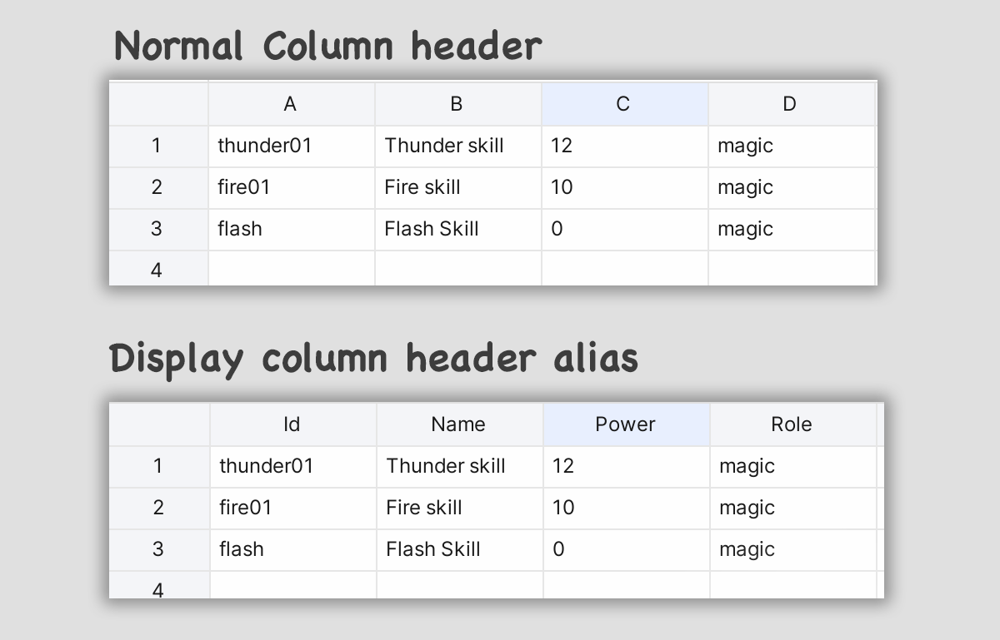

Yade
----

### Introduction

Yade (**Y**et **A**nother **D**ata **E**ditor). Yade is a extendable spreadsheet in side Unity Editor.


### Create Sheet File

Right click in Project Window and select **Create -> Yade Sheet** Menu to create a yade sheet file, double click the file to start editing.

### Edit Sheet

#### 1. Auto Fill

Left mouse down on the auto fill handle in right bottom corner of selector and drag to auto fill cells

#### 2. Add Row/Column or Delete Row/Column

Right click on selected cells and select items to add or delete row/columns


#### 4. Delete Cell

Right click on selected cells and select  `Clear Contents` item or Press `Delete` key on the keyboard will delete selected cells

#### 5. Add Asset Cell

Drag assets from Project Window to yade sheet or using the formula function `ASSET`. For example:

> =ASSET("Assets/icons.json")

Above formula will create a asset cell which point to the asset icon.json

#### 6. Use Formula

Currently, Yade supports below functions and operators:

**Functions:**

* SUM
* MIN
* MAX
* CONCAT
* AVERAGE
* ASEET

Operators:

	* Mins
	* Add
	* Multiply
	* Divide
	* Power

### Import From Files

For now, YADE support import data from excel files (.xlsx, xls) and CSV file.


### Export To Files

We can export data to CSV files by click the **Export** dropdown button. As below image show, we can export raw data (contains formula if exists) and data (don't contains formula) to CSV file.


### Ping In Unity

Click the **Map Location** icon button in toolbar will ping current sheet in **Project Window** of unity editor.

### Column Header Alias

We can add an alias name of a column header instead of just displaying as alpha based index 'A' or 'B'. We can edit and toggle column header alias via the drop down button as below show


A image preview show column changes before and after column header alias turn on:



### Extensions

#### 1. Add Fomula Function

Create a file under **Editor** folder and create an class inhierted from class `FormulaFunction` . Below Sample code will create a function called `Hello` and it return fixed string `Supper man` .

```c#
using Yade.Runtime.Formula;

public class Hello : FormulaFunction
{
    public override object Evalute()
    {
        return "Supper man";
    }

    public override string GetName()
    {
        return "HELLO";
    }
}

```


#### 2. Add A Data Exporter

Create a file under **Editor** folder and create an class inhierted from class `Exporter` . Below sample create a exporter menu named `Hello Exporter` .

```c#
using Yade.Editor;

public class HelloExporter : Exporter
{
    public override bool Execute(AppState state)
    {
        // Do logic of exporter: read data from AppState.data and write to other files
        return true;
    }

    public override string GetMenuName()
    {
        return "Hello Exporter";
    }
}
```


#### 3. Add A Data Importer

Create a file under **Editor** folder and create an class inhierted from class `Exporter` . Below sample create a exporter menu named `Hello Exporter` .

```C#
using Yade.Editor;

public class HelloImporter : Importer
{
    public override bool Execute(AppState state)
    {
        // Do logic of importer: loading data from datasource and write them into AppState.data
      	
      	// If return result is true, yade will refresh ui after importing completed
        return true;
    }

    public override string GetMenuName()
    {
        return "Hello Importer";
    }
}
```


### Support

please visit https://www.amlovey.com/yadeDocs for more details. Or drop an email to <amlovey@qq.com>.