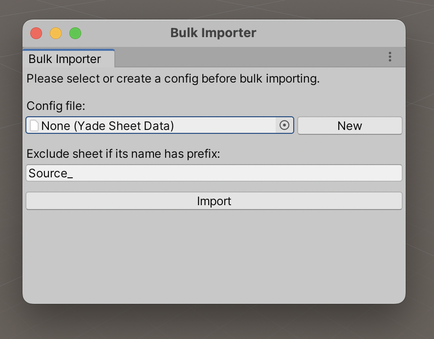
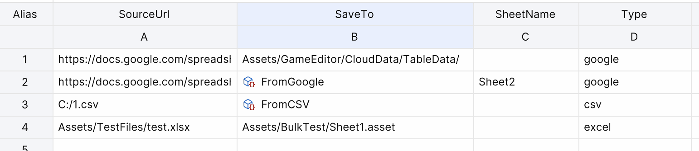
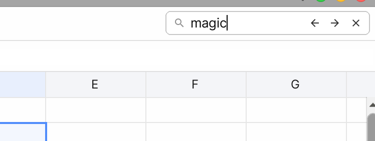
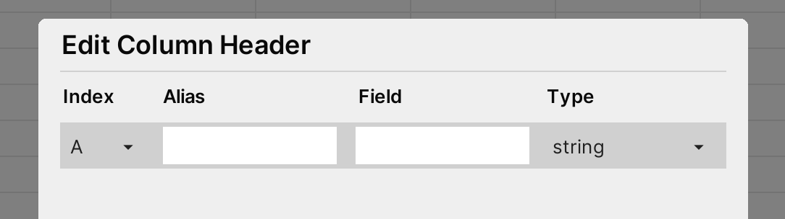

# Spreadsheet Editor

### General

#### Auto Fill

Left mouse down on the auto fill handle in right bottom corner of selector and drag to auto fill cells.

For now, AutoFill supports fill number series. If we don't want to fill number series, just pressing the `SHIFT` key on keyboard when dragging auto fill handle.

#### Add Row/Column or Delete Row/Column

Right click on selected cells and select items to add or delete row/columns


#### Delete Cell

Right click on selected cells and select  `Clear Contents` item or Press `Delete` key on the keyboard will delete selected cells

#### Add Asset Cell

Drag assets from Project Window to yade sheet or using the formula function `ASSET`. For example:

> =ASSET("Assets/icons.json")

Above formula will create a asset cell which point to the asset icon.json

#### Add Enum Cell

Set raw value of cell following the format below:

> =ENUM("[Type]", "[MemberName]")

* `[Type]` threshold is the full name of the enum type
* `[EnumName]` is the name of a member of enum type

For example:

> =ENUM("UnityEngine.DeviceType", "Console")

#### Use Formula

Currently, Yade supports below functions and operators:

**Functions:**

* SUM
* MIN
* MAX
* CONCAT
* AVERAGE
* ASEET (return Unity Object)
* ASSETS (return array of Unity Objects)
* ENUM

*NOTE:*
> 1. Drag assets to spreadsheet editor will create **ASSET** function automatically. 
> 2. Drag assets to spreadsheet editor **with `Ctrl`(Windows) or `Cmd`(macOS) key pressing** will create **ASSETS** function automatically

**Operators:**

* Mins
* Add
* Multiply
* Divide
* Power

### Import and Export


#### Import From Files

For now, YADE supports import data from:
* Excel files (.xlsx, xls)
* Google Sheets (public links) 
* CSV file.

#### Bulk Import

Open the Bulk Importer window form **Tools -> Yade -> Bulk Importer** menu



Select config file or click the `New` button will create an config template file to config data sources.

Exclude sheet name prefix default is `Source_` which means the sheet has name starts with `Source_` will be ignored when importing. 

The config file defines data sources show as below samples.



**Format of  data source:**

- **SourceUrl:** the url of data we want to import
- **SaveTo:** the YadeSheet or path of YadeSheet or folder to save
- **SheetName:** the name of sheet we want to import. **Default it empty.** we can leave it as empty if csv file or just one sheets in excel/google sheets or just want to import first sheet
- **Type:** the type of the source. Built-in types are `csv`, `excel`, `google`. **Default is empty.** If type value is empty, Yade will check the file name and detect the type

**Rules for the data sources:**

1. For any csv file, Yade will mapping it to one Yade sheet
2. For any Google Sheets or Excel, if the **SheetName** is empty and **SaveTo** is a folder, Yade will auto mapping each sheet to Yade sheet asset
3. For any Google Sheets or Excel, if the **SheetName** is not empty and **SaveTo** is a folder, Yade will mapping the sheet specific to a Yade sheet asset with same name
4. For any google sheets or excel, if **SaveTo** is a Yade sheet asset (Yade sheet or Yade sheet asset file path) and the **SheetName** is not empty, Yade will mapping the sheet specific to the Yade sheet asset
5. For any google sheets or excel, if **SaveTo** is a Yade sheet asset (Yade sheet or Yade sheet asset file path) and the **SheetName** is empty, Yade will mapping the first sheet to the Yade sheet asset

#### Export To Files

We can export data to CSV files by click the **Export** dropdown button. As below image show, we can export raw data (contains formula if exists) and data (don't contains formula) to CSV file.

### Search Sheet

We can search cell content via search input in right top corner of main window.



For search input:
1. `Back Arrow` button will go to previous item of results
2. `Forward Arrow` button will go to next item of results
3. `Clear` button will clear search results
4. `Enter` key will go to next item of results when search input text filed is focusing
5. `SHIFT + ENTER` key will go to previous item of results when search input text is focusing

### Sort Sheet

YADE supports sort sheet by column from A-Z or Z-A order. Right click the selected cells, and select sub menus of **Sort Sheet**.

### Ping In Unity

Click the **Map Location** icon button in toolbar will ping current sheet in **Project Window** of unity editor.

### Column Headers

#### Change Column Headers Settings

We can open the **Column Header Settings** window by clicking the button on the toolbar as below image show: 


Column Header Settings window will display as below in new sheet without header setting before:


Click the `+` button at right bottom corner will create a column record.



* **Index Field**: Click the drop to select the column we want to set

* **Alias**: Name or short description

* **Filed**: Used for built-in code generator to generate Filed name of class, only can input words only combine with digit, alpha and `_`, and cannot start with digit

* **Type**: Used for built-in code generator to generate type of filed in class. If cannot find the type in dropdown menu, we can add new types to dropdown list by

  * **Method 1**: Call `DataTypeMapper.RegisterType` method in static constructor of any class. If custom class we also can used Method 2.

  ```csharp
  public class TypeRegister
  {
      static TypeRegister()
      {
          DataTypeMapper.RegisterType<DeviceType>(10001);
      }
  }
  ```

  In the sample, we will register the enum `UnityEngine.DeviceType` to the dropdown list. **Note that, the type key should be unique that larger than 100**

  * **Method 2**: If it's custom class, implement interface `ICellParser` and add attribute `TypeKey` to it

  ```csharp
  [TypeKey(10002)]
  public class NumberData : ICellParser
  {
    public int index;
    public int year;
  
    public void ParseFrom(string s)
    {
      var temp = s.Split(new char[] { ',' }, System.StringSplitOptions.RemoveEmptyEntries);
      if (temp.Length == 2)
      {
        index = int.Parse(temp[0]);
        year = int.Parse(temp[1]);
      }
    }
  }
  ```

#### Display Headers

Right click the header area


### Code Generator

Click the `<>` icon button will open the Code Generator window. Input the class name, preview area will update automatically. **NOTE: class name can only be words only combine with digit, alpha and `_`, and cannot start with digit**.

