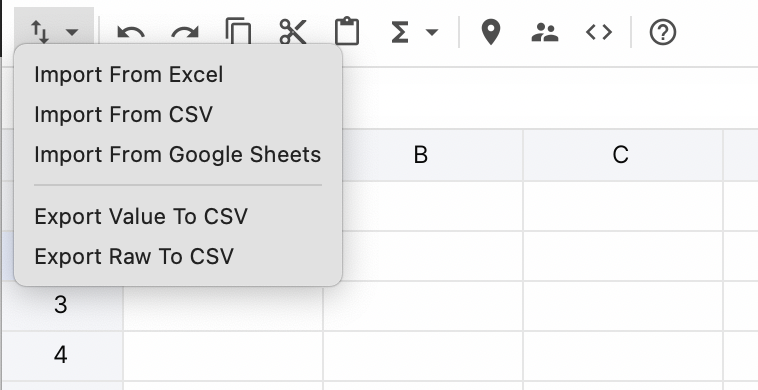
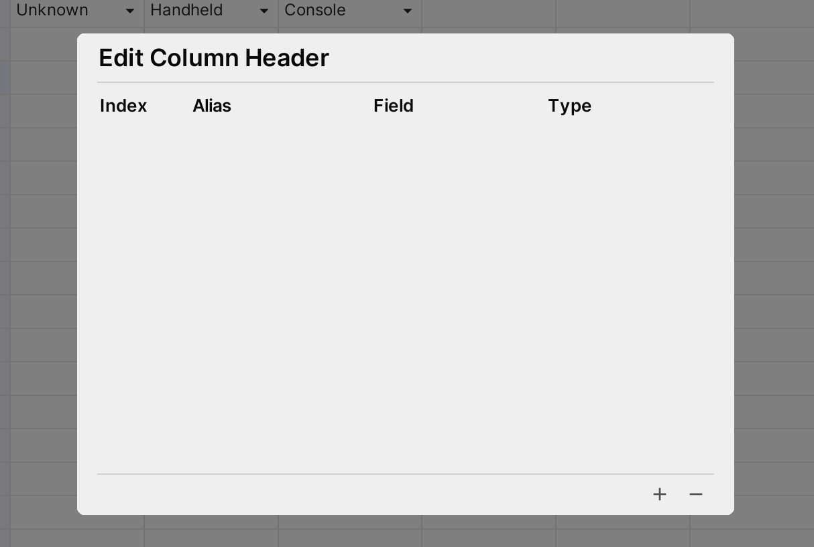
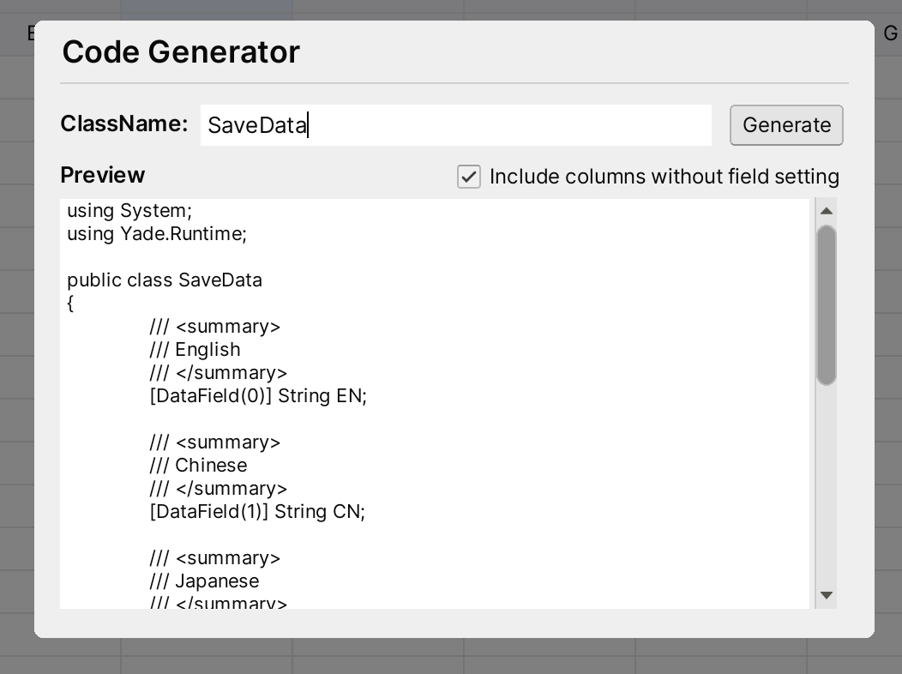

# Spreadsheet Editor

### General

#### Auto Fill

Left mouse down on the auto fill handle in right bottom corner of selector and drag to auto fill cells

#### Add Row/Column or Delete Row/Column

Right click on selected cells and select items to add or delete row/columns


#### Delete Cell

Right click on selected cells and select  `Clear Contents` item or Press `Delete` key on the keyboard will delete selected cells

#### Add Asset Cell

Drag assets from Project Window to yade sheet or using the formula function `ASSET`. For example:

> =ASSET("Assets/icons.json")

Above formula will create a asset cell which point to the asset icon.json

#### Add Enum Cell

Set raw value of cell following the format below:

> =ENUM("[Type]", "[MemberName]")

* `[Type]` threshold is the full name of the enum type
* `[EnumName]` is the name of a member of enum type

For example:

> =ENUM("UnityEngine.DeviceType", "Console")

#### Use Formula

Currently, Yade supports below functions and operators:

**Functions:**

* SUM
* MIN
* MAX
* CONCAT
* AVERAGE
* ASEET
* ENUM

Operators:

* Mins
* Add
* Multiply
* Divide
* Power

### Import and Export

#### Import From Files

For now, YADE supports import data from:
* Excel files (.xlsx, xls)
* Google Sheets (public links) 
* CSV file.



#### Export To Files

We can export data to CSV files by click the **Export** dropdown button. As below image show, we can export raw data (contains formula if exists) and data (don't contains formula) to CSV file.


### Search Sheet

We can search cell content via search input in right top corner of main window.


For search input:
1. `Back Arrow` button will go to previous item of results
2. `Forward Arrow` button will go to next item of results
3. `Clear` button will clear search results
4. `Enter` key will go to next item of results when search input text filed is focusing
5. `SHIFT + ENTER` key will go to previous item of results when search input text is focusing

### Ping In Unity

Click the **Map Location** icon button in toolbar will ping current sheet in **Project Window** of unity editor.

### Column Headers

#### Change Column Headers Settings

We can open the **Column Header Settings** window by clicking the button on the toolbar as below image show: 


Column Header Settings window will display as below in new sheet without header setting before:




Click the `+` button at right bottom corner will create a column record.


* **Index Field**: Click the drop to select the column we want to set

* **Alias**: Name or short description

* **Filed**: Used for built-in code generator to generate Filed name of class, only can input words only combine with digit, alpha and `_`, and cannot start with digit

* **Type**: Used for built-in code generator to generate type of filed in class. If cannot find the type in dropdown menu, we can add new types to dropdown list by

  * **Method 1**: Call `DataTypeMapper.RegisterType` method in static constructor of any class. If custom class we also can used Method 2.

  ```csharp
  public class TypeRegister
  {
      static TypeRegister()
      {
          DataTypeMapper.RegisterType<DeviceType>(10001);
      }
  }
  ```

  In the sample, we will register the enum `UnityEngine.DeviceType` to the dropdown list. **Note that, the type key should be unique that larger than 100**

  * **Method 2**: If it's custom class, implement interface `ICellParser` and add attribute `TypeKey` to it

  ```csharp
  [TypeKey(10002)]
  public class NumberData : ICellParser
  {
    public int index;
    public int year;
  
    public void ParseFrom(string s)
    {
      var temp = s.Split(new char[] { ',' }, System.StringSplitOptions.RemoveEmptyEntries);
      if (temp.Length == 2)
      {
        index = int.Parse(temp[0]);
        year = int.Parse(temp[1]);
      }
    }
  }
  ```

#### Display Headers

Right click the header area


### Code Generator

Click the `<>` icon button will open the Code Generator window. Input the class name, preview area will update automatically. **NOTE: class name can only be words only combine with digit, alpha and `_`, and cannot start with digit**.

